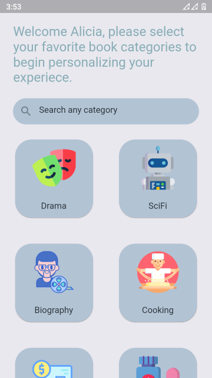
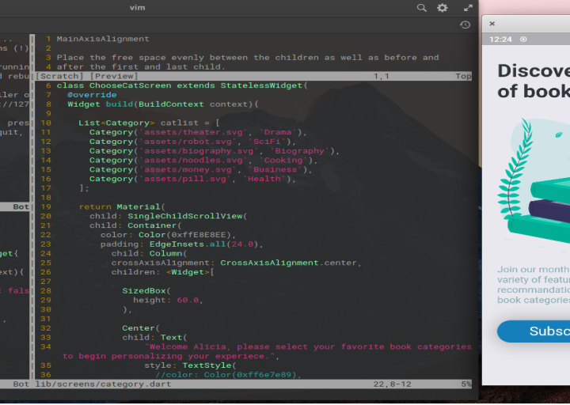
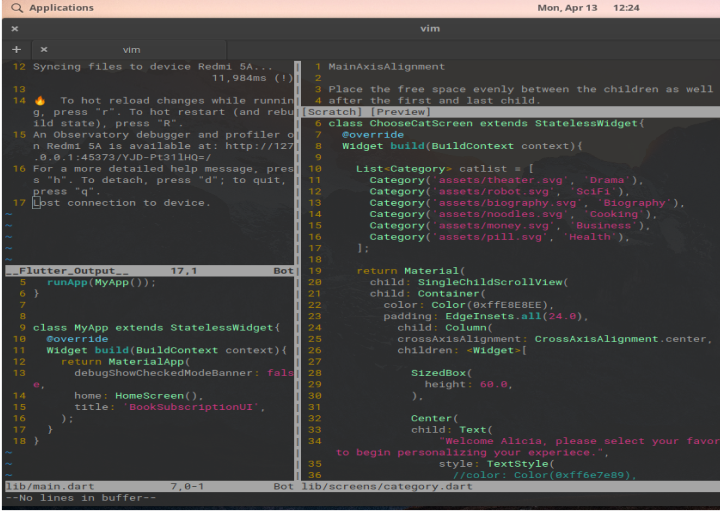

> What We Learn With Pleasure We Never Forget - Alfred Mercier

## (Flutter UI Pracitce Projects) 

> For practice projects, i pick random UI designs by UI/UX designers from Instagram, i try my level best to recreate the UI design in Dart & Flutter. The repo contains all the code and assets used.

## [Book Subscription UI](https://www.instagram.com/p/B9Rp2UwAu9B/) UI is designed by : [Luis Escoto](https://www.instagram.com/designby_luis/)

## Assets Usage Credit

[Freepik](https://www.flaticon.com/authors/freepik)

[flat-icons](https://www.flaticon.com/authors/flat-icons)

## App UI Screenshot

 

## WIP Screenshot

 

